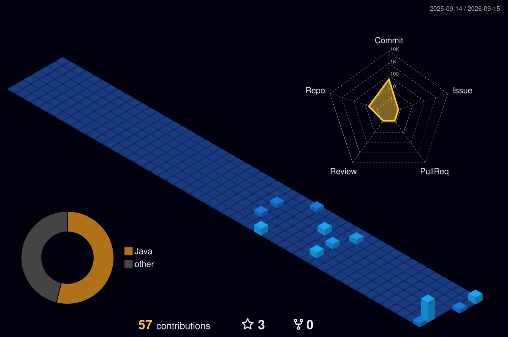

# Olá! Eu sou Rainan Coelho 👋

### 👨‍💻 Sobre mim

- 🎓 Bacharelando em Engenharia de Software pela UNIFSA.
- 💻 Interesse em desenvolvimento Back-end e Banco de Dados.
- ☕ Atualmente aprofundando meus conhecimentos em Java e Spring Boot.
- 🗄️ Experiência acadêmica com desenvolvimento de APIs REST e PostgreSQL.
- 🚀 Em constante evolução, com foco em boas práticas, organização de código e resolução de problemas.
- 🤝 Aberto a aprendizado, colaboração em projetos e novas oportunidades na área de tecnologia.

---
📚 **Pretendo aprender**

Atualmente, pretendo expandir meus conhecimentos nas seguintes tecnologias:

  &nbsp;&nbsp;  &nbsp;&nbsp;  &nbsp;&nbsp;  

Docker • Kubernetes • AWS • JWT

---
## 🛠️ Tecnologias

---

## 🚀 Principais Projetos

### 📦 Sistema de Gestão Logística e Entregas

API REST desenvolvida para gerenciamento de produtos, usuários, estoque, pedidos, pagamentos e entregas.

O sistema possui diferentes tipos de usuários, como clientes, vendedores, motoristas e estoquistas, permitindo o gerenciamento de diferentes etapas do processo logístico.

**Tecnologias utilizadas:**

- Java
- Spring Boot
- Spring Data JPA
- PostgreSQL
- Maven
- Lombok
- Bean Validation

🔗 Projeto em desenvolvimento
https://github.com/RainanCoelho/Sistema_Gestao_Logistica_API.git 

---

### 🩺 Sistema de Casos Clínicos com Inteligência Artificial

Sistema desenvolvido para auxiliar professores e alunos da área da saúde na criação, organização e utilização de casos clínicos.

O projeto utiliza Inteligência Artificial como apoio na geração e adaptação de conteúdos clínicos.

**Tecnologias utilizadas:**

- Java
- Spring Boot
- Spring AI
- API REST
- Banco de Dados

🔗 Projeto em desenvolvimento
https://github.com/RainanCoelho/SistemaAPI_PIBIC.git

---

## 💻 Conhecimentos

---

## 📂 Áreas de Interesse

- ☕ Desenvolvimento Back-end com Java
- 🌱 Spring Boot
- 🔗 Desenvolvimento de APIs REST
- 🗄️ Banco de Dados
- 🌐 Desenvolvimento Web
- 🤖 Inteligência Artificial aplicada a sistemas
- 🏗️ Arquitetura e organização de software

---

## Estatísticas

  

  

  

---

## 📫 Contato

---

### 🚀 Desenvolvendo, aprendendo e evoluindo constantemente.

